# MDM Assistant

## About

This project helps MDM assistants to manage stocks, attendance and calculations of usage, create reports. This app is multi-language (currently Gujarati, Hindi, English) but new languages can be added easily. 

### Key Features

- **Local-First Approach**: All data is stored locally for privacy and offline functionality
- **Flexible Attendance Management**: Users can skip days while filling attendance
- **Dynamic Rate Management**: Change rates and menu for particular days
- **Stock Management**: Stocks can be added later, with unlimited stocks and registers support
- **Real-Time Calculations**: All calculations are recalculated automatically when changes are made
- **Speed Attendance Feature**: Quick attendance entry for efficiency
- **Multi-Language Support**: Currently supports Gujarati, Hindi, and English with easy language addition
- **Comprehensive Reporting**: Generate various reports including storage and usage reports
- **Money Calculator**: Built-in calculator for financial calculations
- **Highly Flexible**: Adaptable to various workflow requirements

## Screenshots

| Registration | Stock Management | Adding New Stock | Daily Entry |
|--------------|------------------|------------------|-------------|
| 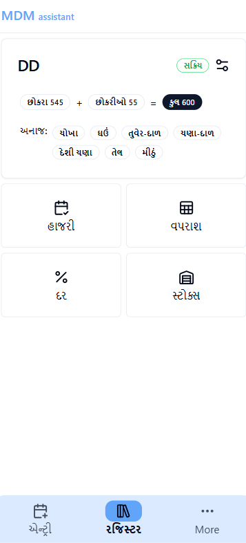 | 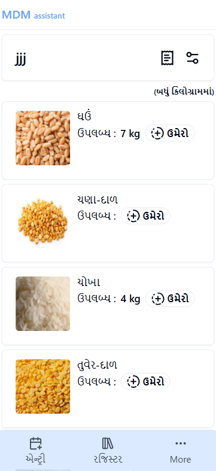 | 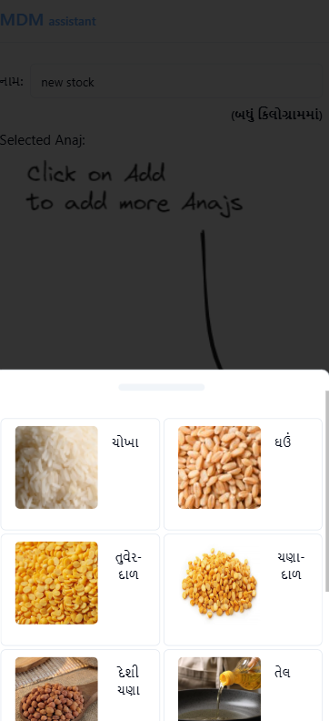 | 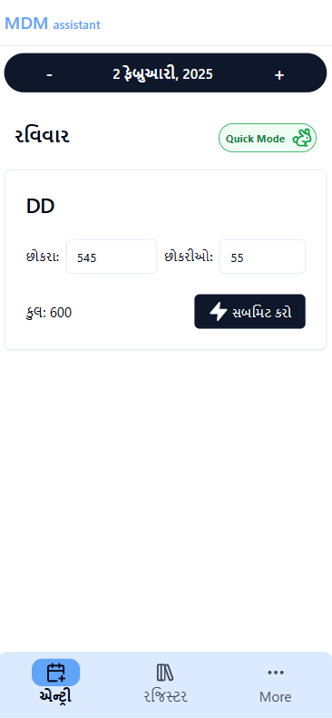 |

| Calculator | Rates | Money Rates | Storage Report |
|------------|-------|-------------|----------------|
| 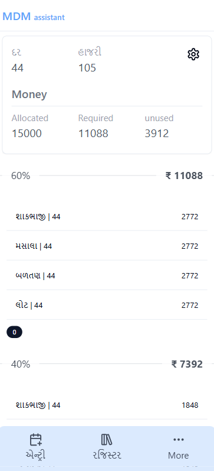 | 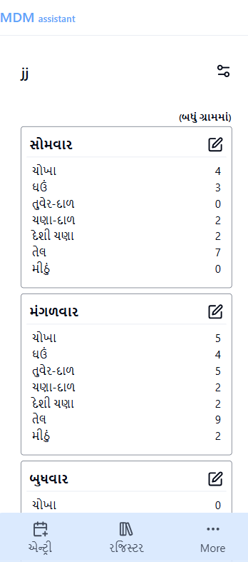 | 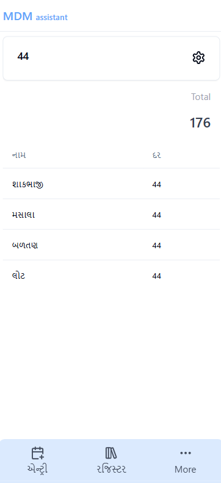 | 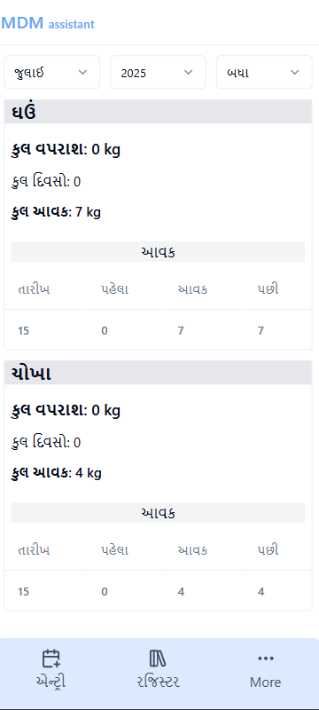 |

| Usage Report | Main Menu | Attendance Report | |
|--------------|-----------|-------------------|---|
| 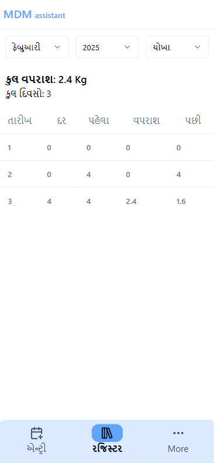 | 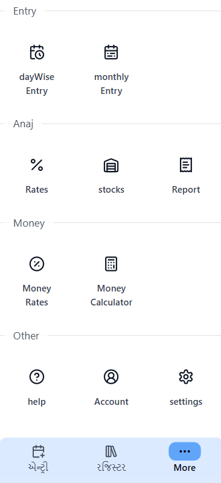 | 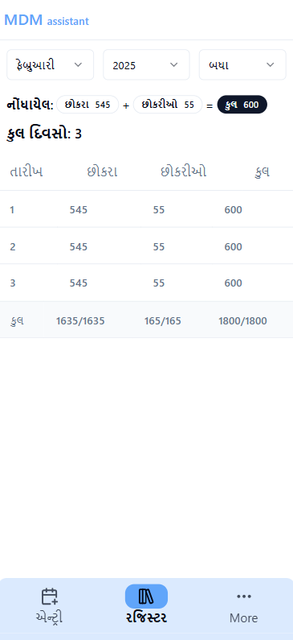 | |
